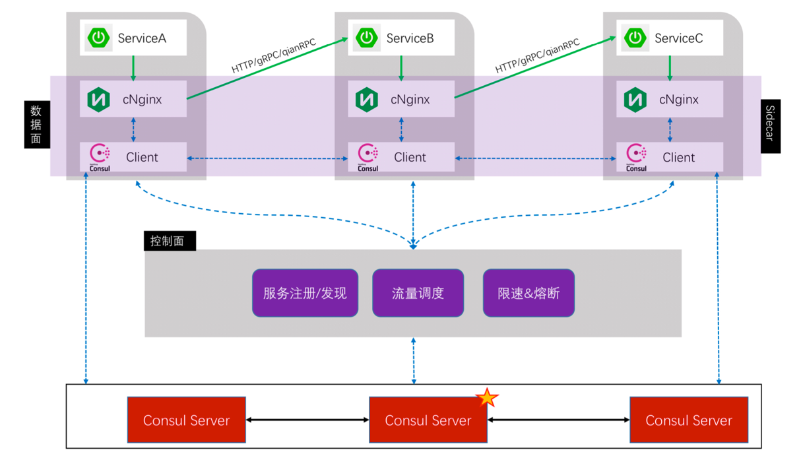
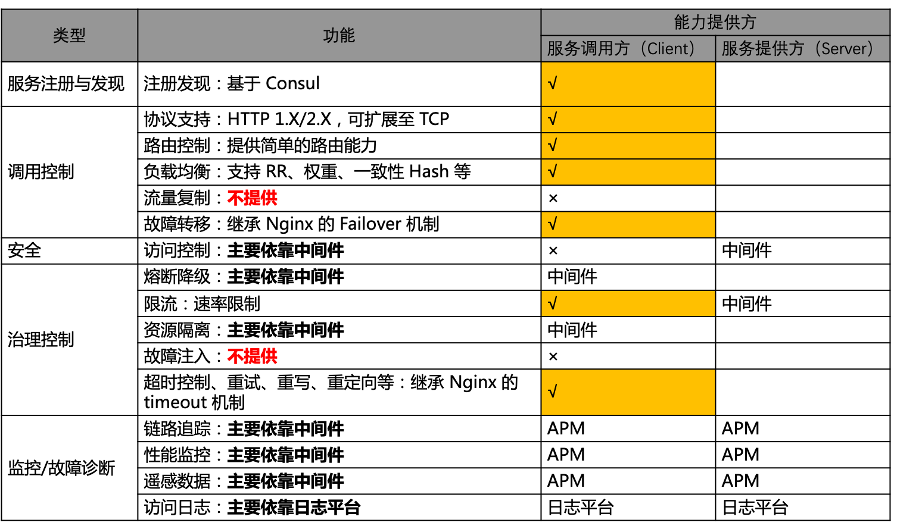
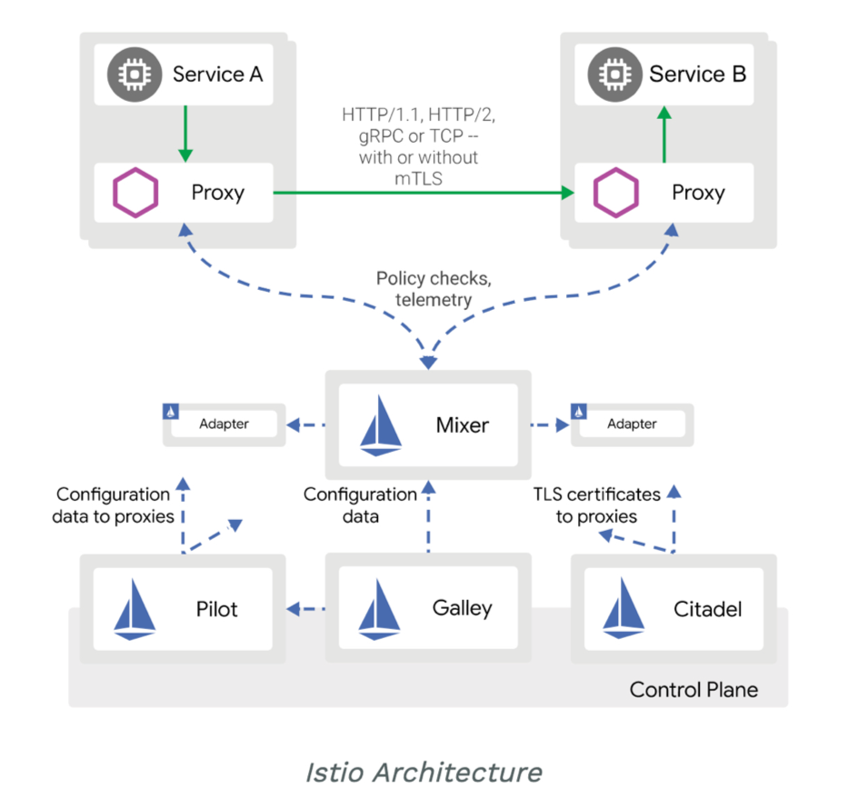
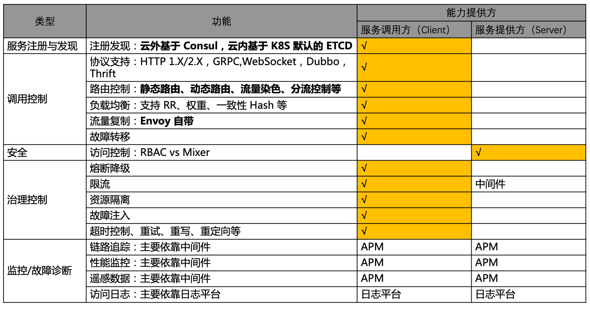
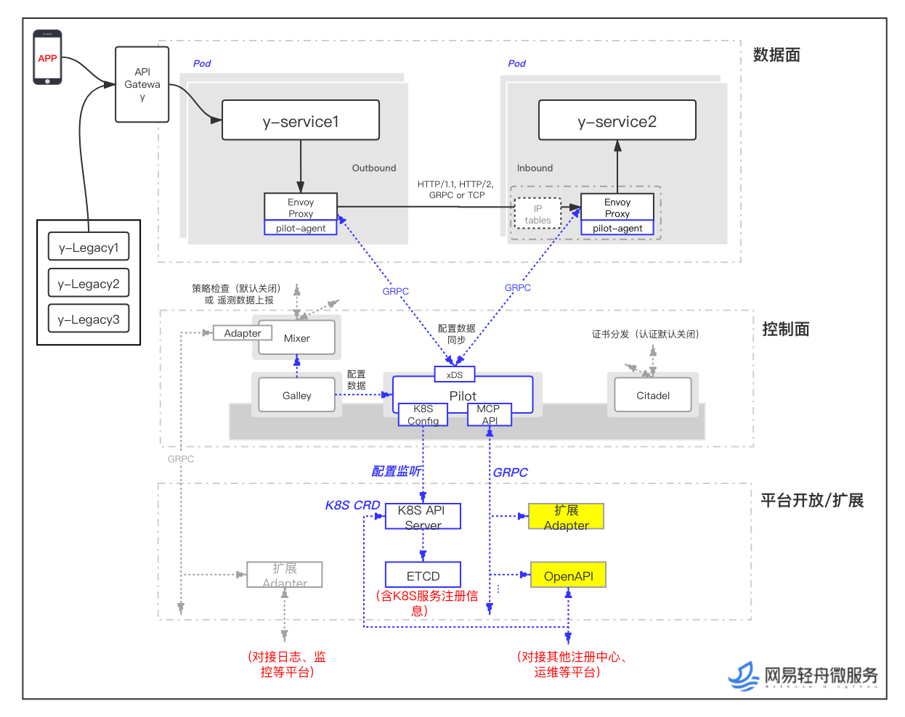
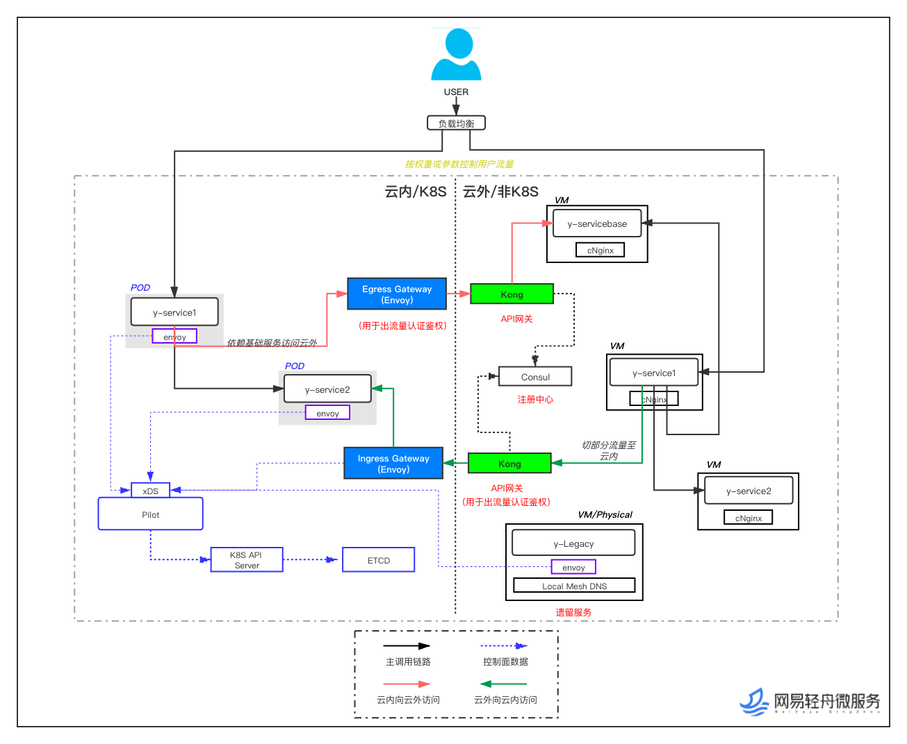
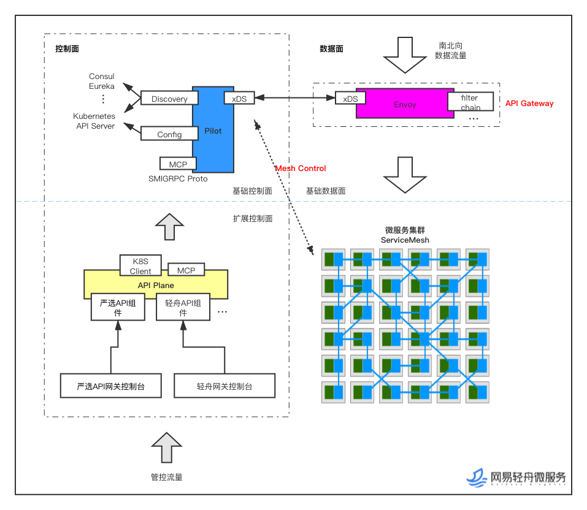

## 背景

Service Mesh在严选的探索与实践大致分了以下几个阶段

#### 第一个阶段是探索期（2015年底~2016年4月）

网易严选从2015年底开始内部孵化到2016年4月正式面世，这个阶段严选的技术团队规模非常小，差不多10人左右，核心业务采用的是单体架构，同时会依赖少量业务基础服务，如推送服务、文件存储服务、消息中心等等。

在这个时期，如果我们将视野扩大到孵化严选的网易邮件事业部，当时采用的主流架构是面向服务的架构(SOA)，但实现上并不统一，有使用中心化的ESB技术提供的服务、也有使用去中心化的Spring Cloud框架提供的服务。

不管是ESB还是以Spring Cloud为代表的分布式服务框架，都有一些典型的问题需要解决，而严选作为一个现象级的电商产品，其可以预见的业务复杂度使得我们不得不重视这次关键的选型，稍有不慎，就有可能会带来非常大的技术负债。

这次基础架构选型过程中，我们主要从三个维度进行了思考：

- **服务治理：RPC 框架 vs 服务治理平台**

	> **通过RPC框架提供服务治理能力还是将服务治理能力平台化？**
	>
	> 通过框架将服务治理能力集成到业务在当时仍是主流，但从内外部诸多的实践结果来看，这种思路仍需要解决大量的问题，其中尤为显著是框架升级问题，业务团队和中间件团队诉求不同，往往推动起来费时费力，一方面影响业务的迭代节奏甚至业务服务质量，另一方面也严重制约中间件的演进效率。
- **多语言 vs Java**
	> **服务治理能力建设是否应该考虑非Java技术栈？**
	>
	> 严选核心业务采用的是Java技术栈，但仍然存在不少非Java的应用系统，比如使用Python技术栈的推荐服务、使用C++技术栈的接入服务以及大量的NodeJS应用，相对而言，Java技术栈的生态更为丰富，如果要拉齐各语言栈的服务治理能力，需要投入大量的研发成本，如果不投入，这些语言栈的服务治理短板未来很有可能成为整个系统的短板。
- **开源 vs 自研**
	> 不管采用哪种基础架构，都需要问两个问题：
	
	> - 是从0开始建设还是基于成熟的开源项目进行扩展？
	> - 如果从0开始建设，是否属于重复造轮子？能额外为社区为公司带来哪些价值？

最后我们决定尝试服务网格（Service Mesh）的理念，并基于Consul和Nginx进行扩展。

#### 第二个阶段是小规模试验期（2016年4月~2017年初）

2016年7月份，我们发布了第一代Service Mesh架构，并陆续在网易邮箱、网易有钱以及网易严选的部分业务进行试点，获得了不错的落地效果，也积累了宝贵的运维经验，同时管控平台也基本成型。

#### 第三个阶段是全面落地期（2017年）

伴随着严选业务规模的不断增长，业务的复杂度不断提升，团队规模也迅速增长，从最初的10余人，到2016年增长到了50人，到2017年迅速突破200人。

从2017年初开始，严选第一代Service Mesh架构在严选逐步铺开并最终全面落地。2019年，基于容器云的网易轻舟微服务平台逐渐成熟，严选也正式启动云化战略，Service Mesh架构作为应用系统云化的核心技术，也进入了**全面升级阶段**。

今天为大家带来的分享主要包括三个部分：

- 严选Service Mesh架构演进
- 混合云架构落地实践
- 规划与展望 

## 严选Service Mesh演进

### 严选第一代Service Mesh架构

严选的**第一代Service Mesh架构**是基于Consul和Nginx进行扩展：

- Consul

	> 一种基于服务的网络解决方案
	>
	> 提供了服务发现、服务注册、服务路由等基本服务治理能力
- Nginx
	> 一种高性能反向代理服务器，具备负载均衡、限流、容错等特性
	>
	> 具备良好的扩展性
	

由于Consul和Nginx自带的特性基本能满足我们的服务治理需求，因此，我们的主要工作是将Consul和Nginx融合成一个Local Proxy（**代号：cNginx**），同时开发一个管控平台将这些能力提供出去。

来看下整体架构：

- 数据面

	> cNginx与Consul Client组成我们的Sidecar, 使用Client Sidecar模式
- 控制面
	
	> 控制面我们提供了服务注册/发现、调用控制、治理控制这三大块能力

### 服务治理能力

从功能视角来看，Service Mesh架构为我们提供了服务注册/发现、健康检查、路由控制、负载均衡、故障转移、服务调用方限流、超时控制、重试等基本的服务治理能力，其他的服务治理能力如访问控制、资源隔离、监控及故障诊断则通过中间件或日志平台完成（如下图所示）
	

**服务治理能力的完善过程也反应了严选现阶段技术平台建设的核心思路：由点带面，小步快跑，完善能力矩阵**

### Service Mesh 为严选带来了哪些架构收益

那么Service Mesh架构的实践与落地为严选带来了哪些架构收益，相信也是大家比较关心的问题

#### 首先是解决了严选的历史包袱，Service Mesh架构使现有的服务可以在不改造的情况下引入了服务治理能力

严选在2016年推出后业务和团队规模增长都非常快，技术基建出现明显的滞后，这也造成了一个局面

- 由于严选技术团队内部没有完全融合，技术栈选择上会有明显的差异
- 同时，每个技术团队对服务治理能力的理解也是不一致的，一方面造成了服务质量参差不齐，另一方面也导致了一些重复造轮子的情况，无形中加大了技术团队横向协作的成本

而Service Mesh作为一个基础设施层，**可以处理并管理服务间的通信**，这种对应用无侵入的特性，使落地过程以及后续的升级过程都无需业务研发团队对服务进行改造，极大的降低了落地阻力，释放了研发团队的生产力。

#### 其次，大大降低了中间件的研发投入和演进成本，也降低了业务和中间件的耦合成本

由于严选采用了Service Mesh架构，很多依赖传统中间件（如RPC框架）的服务治理能力从业务中解耦出来，下沉到Sidecar中，从而使中间件变得更加“轻量”。

由于这种能力的下沉，业务需要依赖的中间件的数量及重量都大大降低

- 对基础技术研发团队来讲，大大降低了中间件的研发投入和演进成本
- 对业务研发团队来讲，也无需把大量的精力投入到中间件的学习与使用，降低了业务和中间件的耦合成本

#### 再次，基础架构与业务架构可以独立演进

在中间件大行其道时，令基础技术研发团队比较头疼的事情是推动中间件的持续演进，往往一次很小的迭代，即使基础技术研发团队认为经过充分的测试，要推动业务研发团队升级也需要投入极大的心力与体力，同时消耗大量的开发和测试资源，这种**与演进价值不对等的投入**导致了中间件演进速度慢、效果差、历史包袱越来越重。

Service Mesh架构可以很完美的解决这个痛点，使应用与基础设施层解耦开来，带来巨大的工程价值

- 使业务研发团队可以专注于业务领域与业务架构本身
- 使基础技术研发团队也可以专注于技术领域，由于Service Mesh架构与应用天然隔离，其演进价值更容易被量化，而有了量化数据的支撑，基础架构的演进速度才会更快、演进效果也会更好

#### 最后，Service Mesh架构为多语言栈提供了服务治理能力

Service Mesh架构出现之前，由于相同的语言栈有明显的协同优势，这显然会导致研发团队在选择语言栈时会有所顾虑，甚至不是按照适用的场景选择语言，比如初创团队一开始选择使用了Java、PHP、Golang，一般后续大部分项目都会采用相同的语言，但每种编程语言都有自己的优势和适用场景，随着业务规模的扩大、业务场景的丰富或者多团队业务的整合，就会出现多语言栈的协同与服务治理问题。

Service Mesh架构天然可以解决多语言栈的问题，使得非Java语言栈，尤其是新兴的语言，优势更容易被挖掘，技术生态的劣势不至于被放大。

### 持续演进的诉求

虽然严选第一代Service Mesh架构为严选带来了非常大的工程价值和架构收益，但仍不完美，需要持续演进

一方面，我们需要更丰富和更高质量的服务治理能力，比如：

- 增强流量管理能力，比如流量染色、分流控制等
- 将更多治理特性（如限流、熔断、故障注入）与业务架构解耦
- 支持更多的协议
- 增强控制面能力

另一方面，我们也需要支持应用系统全面云化战略以及混合云或多云架构

### 行业技术演进 - 通用型Service Mesh出现

在严选实践Service Mesh架构的时候，我们注意到，伴随着云原生浪潮和微服务浪潮，通用型Service Mesh开始出现。

2016年9月29日，Service Mesh的概念被第一次公开提出，这要感谢Linkerd的CEO William及Buoyant公司，他们提出并定义了Service Mesh，并将Service Mesh的第一个开源项目Linkerd贡献给了CNCF。

这之后出现了多个开源项目，比较知名的如Lyft公司的Envoy和Nginx的nginmesh，其中Envoy在2017年9月也加入了CNCF。

早期的Service Mesh主要聚焦在数据面能力，同时附带简单的控制面，与沉淀多年的中间件相比并没有明显的功能优势与性能优势（甚至性能上还有劣势），因此在业内并没有引起太大的反响。但这一切，随着Istio的出现发生了扭转，Istio为Service Mesh带来了前所未有的控制力，并迅速成为了Service Mesh领域的事实标准，Linkerd、Envoy、nginmesh都已经主动拥抱了Istio。我们的轻舟微服务团队也迅速跟进了Istio和Envoy，成为社区的早期参与者之一。

### 云原生 Service Mesh 框架 - Istio

Istio由Google，IBM和Lyft联合开发，与 Kubernetes 一脉相承且深度融合：

- Kubernetes 提供了部署、升级和有限的运行流量管理能力
- Istio 补齐了 Kubernetes 在微服务治理能力上的短板（如限流、熔断、降级、分流等）
- Istio 以 Sidecar 的形式运行在 Pod 中，自动注入，自动接管流量，部署过程对业务透明

Istio提供了完整的Service Mesh解决方案：

- 数据面
	- 数据面支持多种协议（如HTTP 1.X/2.X，GRPC等），控制服务所有进出流量，同时负责控制面制定的策略执行，并上报遥感数据
	- Istio默认的Sidecar是Envoy，它是基于C++开发的L4/L7高性能代理（对标NGINX）
	- 具有强大的流量管理能力、治理能力与扩展能力
- 控制面
	- Pilot：提供服务发现与抽象能力，负责配置转换与分发（如动态路由等）
	- Mixer：访问控制、接收遥感数据等
	- Citadel：提供安全证书与秘钥的下发和管理能力。
	- Galley：提供配置校验能力

接下来我们将从功能和性能两个视角来看下基于Istio的Service Mesh解决方案。

### 功能视角 - 服务治理能力 – 基于Istio+Envoy

从功能视角来看，相比于严选**第一代Service Mesh架构**，在流量管理能力方面（如流量染色、路由控制、流量复制等）有明显的增强，在治理控制方面的能力也更为丰富，提供了如熔断降级、资源隔离、故障注入等能力，在访问控制方面也提供了更多选择。

### 性能视角 – cNginx vs Envoy（优化前）

在Service Mesh架构实践和落地过程中，大家最关心的问题是性能问题，Service Mesh架构虽然解决了很多基础架构的痛点，但相比于原来的一次远程调用，会额外增加1~2跳，直觉告诉我们这会带来额外的延时。

根据我们的压测数据，主机配置为8C16G（严选应用服务器的规格，与cNginx共享），在40并发、1600RPS的情况下，与直连相比，cNginx的延时增加0.4ms（相比直连），Envoy（社区版本，优化前）Client Sidecar模式延时增加0.6ms（相比直连）。

cNginx和Envoy Client模式对性能的影响都比较小，在可接受范围之内。另外，传统的带服务治理能力的中间件（如Spring Cloud/Dubbo等）同样会带来性能开销和资源开销，因此，实际的性能影响其实更小（从前面蚂蚁和酷家乐分享的性能数据来看，Sidecar模式与SDK模式相比，蚂蚁应用场景的平均延时增加约0.2ms，而酷家乐应用场景的延时甚至还有降低）。

### 性能视角 – cNginx vs Envoy（优化后）

由于Service Mesh架构的Sidecar和应用不在一个进程中，因此针对Service Mesh数据面的优化路径会更丰富，优化的可持续性也更强，同时由于优化效果的干扰因素更小，优化数据会更有说服力。

我们的轻舟微服务团队对容器网络和Envoy做了初步的优化：

- 采用 SRIOV 容器网络 
- Envoy：将1.13版本中 connection loadbalancer 特性移植到 1.10.x 版本

根据我们的压测数据

- 在并发较低（<64）、1000RPS的情况下，**Envoy优化后的版本在容器网络下开启Client Sidecar**表现要优于虚拟机网络的直连，相较于容器网络直连开销增加0.2~0.6ms
- 在并发较高（>=64）、1000RPS的情况下，**Envoy优化后的版本在容器网络下开启Client Sidecar**表现要远远优于虚拟机网络cNginx的性能，与虚拟机网络的直连性能几乎相当；但相较于容器网络直连1~5ms左右的延时

由于严选绝大部分应用的并发在40以下，这个性能表现可谓是相当不错，也极大提升了我们对Service Mesh架构进行升级的信心。

### 当前演进方向

因此，严选当前Service Mesh架构的演进方向是基于 Istio+Envoy 的方案：

- 数据面以 Envoy Proxy 作为代理组件
- 控制面以 Pilot 为核心组件
- 平台开放与扩展主要通过 Kubernetes CRD与Mesh Configuration Protocol（简称为 MCP，一套标准 GRPC 协议）
- 高可用设计主要基于 Kubernetes 及 Istio 机制实现

## 混合云架构落地实践

2019年，严选正式启动云化战略，并明确使用容器化和Service Mesh技术对严选应用系统进行云化，由于严选当前虚拟机集群采用的是Service Mesh架构，因此，在应用系统云化过程中，我们也充分体会到了与业务解耦的基础设施层带来的工程价值，目前严选已经有超过90%的B端业务完成了容器化改造及Service Mesh架构升级。

### 严选上云 Roadmap

来看下严选上云 Roadmap，主要分成三个阶段

- IDC（私有云）时期：应用系统部署在虚拟机集群
- 混合云时期：部分应用系统部署在容器环境，部分部署在虚拟机环境，且存在同一个服务部署在多个运行环境的情况；**这也是目前严选所处的阶段**
- 云化/多云时期：应用系统完全云化，部署在多个容器环境，甚至部署在多个云服务商

### 落地关键步骤

根据我们的实践，混合云架构的落地需要处理好四个关键步骤

#### 首先是要坚定的拥抱云原生

- 应用全面云原生化可以最大化的发挥云的优势，已经是大势所趋，因此，无论企业还是个人都不应该忽视这种趋势
- 以容器、Service Mesh、微服务、Serverless为代表的云原生技术相辅相成
	- 容器化是云原生的重要基石，是微服务的最佳载体，同时也使Service Mesh高效落地的基石
	- Service Mesh架构可以从流量管控层面消除虚拟机和容器这两种运行环境的差异性，可以很好的支持混合云或者多云模式，是混合云或者多云架构可以**高效落地的关键步骤**

#### 其次是要建设好服务治理平台

- 借助服务治理平台，可以无缝衔接虚拟机环境和容器环境的服务治理能力，整合Service Mesh的控制面能力，最大化的发挥Service Mesh的优势
- 借助服务治理平台提供的流量管控和路由控制能力，可以透明的控制应用系统在混合云架构下的服务形态，使应用系统可以平滑的从私有云迁移到混合云或者多云
- 借助服务治理平台整合混合云架构的监控和告警事件，使Service Mesh的可用性被实时的监控起来，可运维性也更好

#### 再次是建设统一的部署平台

- 统一的部署平台可以从部署层面消除虚拟机和容器这两种运行环境的差异性，从而向业务研发团队屏蔽混合云架构的底层复杂性
- 统一的部署平台可以自动注入Service Mesh的Sidecar，使业务无需感知基础架构
- 统一的部署平台可以整合Service Mesh的控制面能力以达到混合云架构下部署过程的平滑以及部署完成后的灰度引流能力，从而加速应用系统的云化进程

#### 最后是要做好灰度引流

灰度引流包括服务间调用的灰度引流和外域调用（用户流量）的灰度引流，通过灰度引流，可以从私有云架构平滑迁移到混合云架构，而平滑迁移的能力也是Service Mesh在混合云架构落地的关键

### 平滑迁移

这里重点讲下我们如何做到私有云架构向混合云架构平滑迁移

- 通过边缘网关实现各个LDC（LDC是一组应用、数据和网络的逻辑单元）相互联通
	- 边缘网关屏蔽了每个LDC不同的基础架构，可以简化迁移的流程
	- 边缘网关同时也可以用于流量认证鉴权，在混合云架构中跨LDC的访问场景发挥重要作用
- 兜底路由设计
	- 兜底路由使流量在尽可能不从当前AZ逃逸的情况下，提供了一种高可用的解决方案，使同环境的LDC可以互相备份
- 访问控制：从私有云架构迁移到混合云架构的过程中，访问控制的平滑迁移是个难点，严选目前主要采用两种手段
	- IP池化技术：主要面向数据库等依赖IP管控权限的基础服务
	- 通过Service Mesh的能力实现基于服务的权限管控
- 提供灰度引流能力，使基础架构及业务的迁移状态对调用方透明；这个过程需要处理好内部流量和外域流量

### API 网关

外域流量的灰度引流能力需要API网关做好能力支持，混合云架构下的API网关需要在控制面融合虚拟机环境和容器环境的API网关管控能力

- 整体基于 Envoy+Pilot 方案：
- 数据面
	- 容器环境以 Envoy Proxy 作为代理组件
	- 虚拟机环境以Kong作为代理组件
- 控制面以 Pilot 为核心组件
- 平台开放与扩展主要通过 Kubernetes CRD与Mesh Configuration Protocol（简称为 MCP，一套标准 GRPC 协议）

如图所示，具体的技术细节这里不做展开

### 质量保障体系

Service Mesh作为基础架构，其自身的交付质量也非常重要。

要提高Service Mesh架构的交付质量和运维质量，主要从以下几个方面入手：

- 建立CICD流程，完善单元测试和集成测试
- 完善性能基准自动测试，并持续跟踪性能数据
- 完善监控报警，使基础架构的运行状态是被监控的
- 完善版本升级机制
	- **支持Envoy热更新**
	- 提供灰度发布机制，做到业务可灰度和流量可灰度
	- 提供多级环境，建设基础架构的演练、测试、灰度及发布的规范流程
- 引入业务回归验证流程

### 一些坑

当然Service Mesh架构的落地过程也并非一帆风顺，还是有些坑需要绕过去，比如：

- Envoy 目前编译版本存在 Bug
	- 在 Istio Pilot 升级到加入 accesslog 相关配置下发功能版本后，Envoy 在一定压力访问或有客户端主动断开请求时，会进入一段存在问题的断言（assert）逻辑，导致 envoy crash，此时请求方表现为 502 异常
	- 社区将在新版本中清理这段问题断言逻辑（<https://github.com/envoyproxy/envoy/issues/9083>），对于旧版本，社区目前给出的优化建议是在 envoy 编译选项使用 -opt（默认为 -dbg）
- Mixer 性能陷阱
	- Mixer的性能问题一直被诟病，比如打开 Mixer 的策略执行功能，每一次调用 Envoy 都会同步调用 Mixer 进行一次策略检查，导致性能衰减非常迅速，当然社区也已经意识到这个问题并在着手进行优化
	- 作为 Mixer 策略执行的替代品， Istio 的 RBAC 也是可以满足一部分功能的，比如服务白名单我们就是通过 RBAC 来实现

## 规划与展望

Service Mesh架构发展到现在仍有较大的发展空间，严选和轻舟微服务团队后续将主要从性能和功能两个维度进行持续的探索与演进。

### 性能优化方向

性能方面，目前主要有两个研究方向

- 方案1: 采用 eBPF/xDP(sockops)，优化路径为 SVC <-> Envoy，保守预计，延迟性能提升10-20%。 Envoy 部署方式 per-pod，跟社区方向一致，也是目前严选采用的部署方案。
- 方案2: 采用 DPDK+Fstack 用户态协议栈，优化路径为 Envoy <-> Envoy，延迟性能提升0.8-1 倍。Envoy 部署方式为 per-node，功能和运维层面的限制还在评估当中。

结论：Sidecar 模式采用方案1进行优化，gateway 模式采用方案2进行优化。 

### 服务治理平台 – 升级严选服务治理能力

功能方面，我们主要通过轻舟微服务治理平台来提供更丰富、更高质量的服务治理能力。

- 增强调用控制和治理控制能力
	- 比如通过平台化能力为业务提供限流、熔断和故障注入能力，降低业务研发团队的学习成本
- 提供平台化的访问控制能力，使访问控制不是作为一个技术需求，而是作为服务的产品化运营能力
- 根据精细化的运维能力

## 总结

今天的分享首先为大家介绍了Service Mesh架构在严选的演进历程，然后分享了Service Mesh在严选混合云架构落地过程中发挥的关键作用、遇到的一些问题及我们的经验，最后概述了一下目前我们正在做的两块工作：Service Mesh性能持续优化以及服务治理平台能力持续增强。

严选的实践说明目前Service Mesh架构成熟度已经具备了大规模落地的条件，希望我们的工作可以为社区带来借鉴意义。

最后感谢Service Mesh Meetup组委会邀请，感谢大家聆听。

### 作者简介

王国云，网易严选中台技术团队负责人，容器化负责人。

2008年加入网易，长期从事一线的研发与管理工作，擅长技术架构及技术体系建设，曾参与或负责过网易博客、网易邮箱、网易有钱等多个核心产品的研发工作，现任严选中台技术团队负责人，负责严选的容器化及Service Mesh演进。